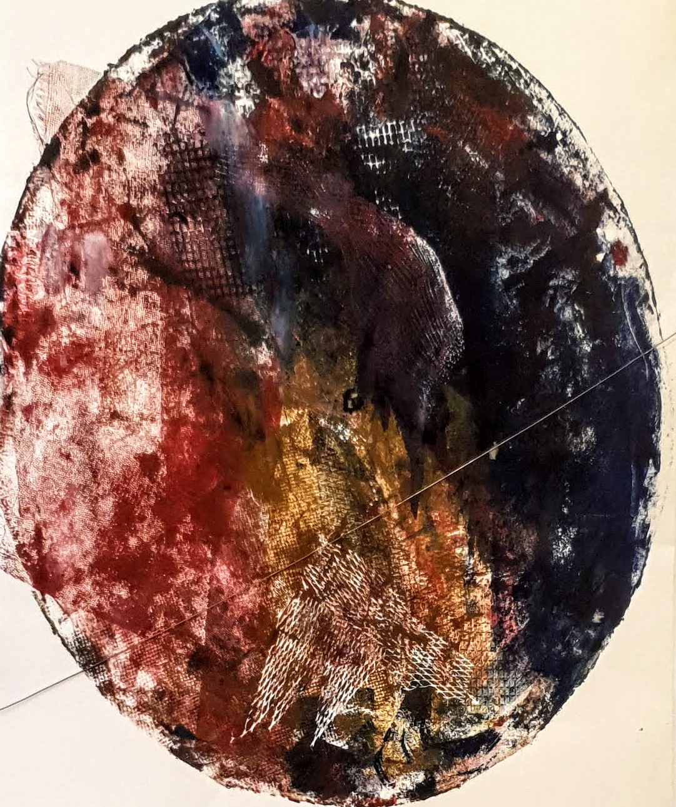

title: About
date: 2020-07-01

Hi,  

As a data anthusiatstic I enjoy working with data and facinated how the AI arena is developing. With years of PM experience I always try to focuse on the customer value, while execting the project in an agilic manner. 

I'm invloved in a gamut of data projects from various sources, while promoting data driven intelligence analysis. I have hands-on development and deployment experiance in data-pipelines and models.  I have lead numerous POC, and was an account manager for clients in Israel and abroad.  
I enjoy the Geo-Spatial arena and have developed an Enterprise GIS to provide GIS serivces to various clients and useres.

I enjoy sports and cooking and always looking forward to my next capming trip...
 

